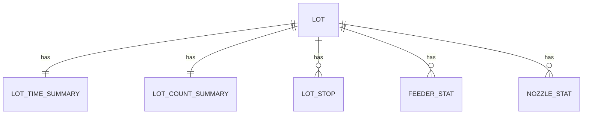

# NPM ProductReport LOG 데이터 수집 정의

---

## 1. 개요

- 대상 설비: ??
- 대상 로그: ProductReport
- 원칙  
  - LOG 파일 1개 = LOT 1개  
  - LOT 기준으로 모든 데이터 수집

---

## 2. ERD



---

## 3. 테이블 구조

### 3.1 LOT

| 컬럼명 | 설명 | LOG 위치 |
|------|------|---------|
| lot_id | LOT ID | [Information].LotName |
| machine | 설비명 | [Index].Machine |
| lane | Lane 번호 | [Information].Lane |
| product_id | 제품 ID | [Information].ProductID |
| rev | Revision | [Information].Rev |
| start_time | 시작 시각 | [Index].Date |
| end_time | 종료 시각 | 수집 시각 |

---

### 3.2 LOT_TIME_SUMMARY

| 컬럼명 | 설명 | LOG 위치 |
|------|------|---------|
| lot_id | LOT ID | FK |
| prod_time | 생산 시간 | [Time].Prod |
| actual_time | 실제 생산 시간 | [Time].Actual |
| mount_time | Mount 시간 | [Time].Mount |
| total_stop_time | 총 정지 시간 | [Time].TotalStop |
| rwait_time | Rear Wait | [Time].Rwait |

---

### 3.3 LOT_COUNT_SUMMARY

| 컬럼명 | 설명 | LOG 위치 |
|------|------|---------|
| lot_id | LOT ID | FK |
| board_cnt | Board 수 | [Count].Board |
| module_cnt | Module 수 | [Count].Module |
| total_pickup_cnt | Pickup 수 | [Count].TPickup |
| total_mount_cnt | Mount 수 | [Count].TMount |
| pickup_miss_cnt | Pickup Miss | [Count].TPMiss |
| retry_miss_cnt | Retry Miss | [Count].TRMiss |

---

### 3.4 LOT_STOP

| 컬럼명 | 설명 |
|------|------|
| lot_id | LOT ID |
| stop_type | Stop 코드 |
| stop_time | 정지 시간 |
| stop_count | 발생 횟수 |

---

### 3.5 FEEDER_STAT

| 컬럼명 | 설명 | LOG 필드 |
|------|------|---------|
| lot_id | LOT ID | LotName |
| head_table_no | Head Table | BLKCode |
| feeder_no | Feeder No | FAdd |
| part_no | Part Name | PartsName |
| pickup_cnt | Pickup | Pickup |
| pmiss_cnt | Pickup Miss | PMiss |
| rmiss_cnt | Retry Miss | RMiss |
| mount_cnt | Mount | Mount |

---

### 3.6 NOZZLE_STAT

| 컬럼명 | 설명 | LOG 필드 |
|------|------|---------|
| lot_id | LOT ID | LotName |
| head_no | Head No | Head |
| nozzle_no | Nozzle No | NCAdd |
| pickup_cnt | Pickup | Pickup |
| pmiss_cnt | Pickup Miss | PMiss |
| mount_cnt | Mount | Mount |

---

## 4. LOG 파싱 규칙

### 4.1 파일 이름
- Production Report 
  파일이름 [Timestamp]-[Machine]-[Stage]-[Lane]-[Head]-[LotName].[LogType]
  20260116000000391-05-1-1-3-NAD_H_T_EBR37416101.u01
- 


### 4.2 공통

- [Section] 단위 파싱
- Key=Value 형식 사용
- 문자열 따옴표 제거
- 숫자 필드는 int / float 변환

---

### 4.3 Header / Summary 영역

대상 섹션
```
[Index]
[Information]
[Time]
[Count]
```

처리 방식
- LOG 1개당 1회 파싱
- LOT / LOT_TIME_SUMMARY / LOT_COUNT_SUMMARY 각각 1 Row 생성

---

### 4.4 Feeder / Nozzle 영역

대상 섹션
```
[MountPickupFeeder]
[MountPickupNozzle]
```

처리 방식
- 데이터 라인 1줄 = DB Row 1개
- lot_id는 상위 LOT에서 주입

---

### 4.5 STOP 데이터 처리

LOG 예시
```
[Time]
SCStop=70.83

[Count]
SCStop=2
```

변환 결과

| lot_id | stop_type | stop_time | stop_count |
|------|-----------|-----------|------------|
| LOT | SCStop | 70.83 | 2 |

- Time / Count 모두 존재하는 항목만 저장
- 값이 0이면 저장 제외 가능

---

